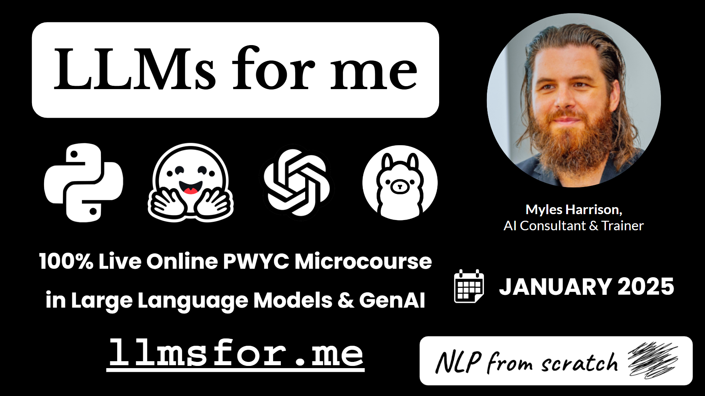

# LLMsfor.me 🔠⚡🤖🧠😃

A Pay-What-You-Can (PWYC) Microcourse in Large Language Models

**Date**: 📅 January-February 2025  
**Author** ✍️: Myles Harrison, AI Consultant & Trainer  
**Link** 🔗: [llmsfor.me](https://llmsfor.me)  

LLMs have transformed the world – be a part of the transformation with the LLMsfor.me course! In this 6-week, 18 hour program, we’ll go hands-on and touch on a wide variety of platforms and tools in the large language models and generative AI space, including working with LLMs 100% and generating images with multimodal models.

This course is for anyone looking to learn more and technically upskill into working with LLMs, from AI enthusiasts and beginners to those already practicing data science. Some experience with Python or another programming language is suggested though not absolutely required.

At NLP from scratch, I believe that education should be accessible to everyone, regardless of their financial situation. That’s why I’m offering the course under a [Pay What You Can (PWYC) model](https://www.nlpfromscratch.com/pwyc). You choose the amount you can comfortably afford, and pay based on what you feel the course was worth. There’s no minimum or maximum amount, and you can pay when you first sign up or after you’ve finished attending the course – the choice is up to you.

## Curriculum
The course covers the following at a high level, with simple code examples to get the non-technical practitioner unfamiliar with LLMs and Generative AI started:
- **Part 1 - Introduction to LLMs and Generative Text**
  - Slides: <a href="llmsfor.me/slides/1. LLMs for me - Introduction LLMs & Generative Text.pdf">1. LLMs for me - Introduction LLMs & Generative Text.pdf</a> 
  - Notebook: <a href="llmsfor.me/notebooks/1. LLMs for me - Intro to LLMs & Generative Text.ipynb">1. LLMs for me - Intro to LLMs & Generative Text.ipynb</a>
    
- **Part 2 - Fine-tuning LLMs, PEFT and Quantization**
  - Slides: <a href="llmsfor.me/slides/2. LLMS for me - Fine-tuning & Quantization.pdf">2. LLMS for me - Fine-tuning & Quantization.pdf</a> 
  - Notebook: <a href="llmsfor.me/notebooks/2. LLMs for me - Fine-tuning & Quantization.ipynb">2. LLMs for me - Fine-tuning & Quantization.ipynb</a>
    
- **Part 3 - GPT and the OpenAI Ecosystem**
  - Slides: <a href="llmsfor.me/slides/3. LLMs for me - GPT & the OpenAI Ecosystem.pdf">3. LLMs for me - GPT & the OpenAI Ecosystem.pdf</a> 
  - Notebook: <a href="llmsfor.me/notebooks/3. LLMsfor me - GPT and the OpenAI Ecosystem.ipynb">3. LLMsfor me - GPT and the OpenAI Ecosystem.ipynb</a>
    
- **Part 4 - Developing Large Language Model Applications Locally**
  - Slides: <a href="llmsfor.me/slides/4. LLMs for me - Local LLM Development.pdf">4. LLMs for me - Local LLM Development.pdf</a> 
  - Code: [ollama_test.py](llmsfor.me/code/ollama_test.py), [openai_test.py](llmsfor.me/code/openai_test.py)
- **Part 5 - Multimodal LLMs and Frameworks**
  - Slides: <a href="llmsfor.me/slides/5. LLMs for me - Multimodal LLMs and Frameworks.pdf">5. LLMs for me - Multimodal LLMs and Frameworks.pdf</a> 
  - Notebook: <a href="llmsfor.me/notebooks/5. LLMs for me - Multimodal Modals and Frameworks.ipynb">5. LLMs for me - Multimodal Modals and Frameworks.ipynb</a>
    
- **Part 6 - Case Study in LLMs and GenAI**
  - Slides: <a href="llmsfor.me/slides/6. LLMs for me - Case Study in LLMs & Generative AI.pdf">6. LLMs for me - Case Study in LLMs & Generative AI.pdf</a> 
  - Code: [casestudy.zip](llmsfor.me/code/casestudy.zip)

## Details 
### Course Overview:
- ⌛ Duration: 6 Weeks, January-February 2025  
- 📅 Dates: Mondays 7-10 PM EST: Jan 6th to Feb 10th
- 🕒 Sessions: 6 Sessions, 3 Hours Each  
- 💻 Format: Live Online, Interactive Sessions via Google Meet  
- 💰 Pricing: [Pay What You Can (PWYC)](https://www.nlpfromscratch.com/pwyc)