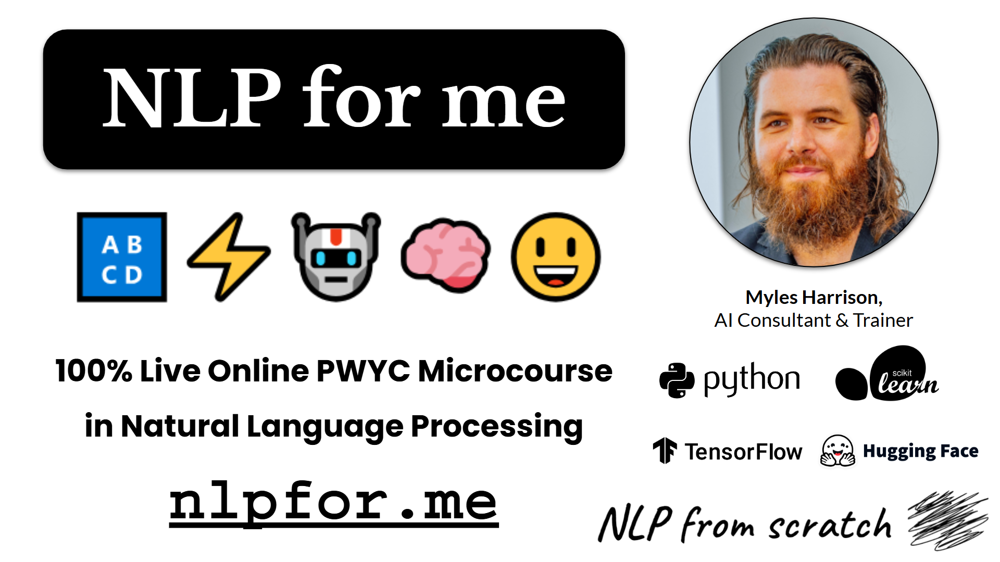

# NLPfor.me 🔠⚡🤖🧠😃

A Pay-What-You-Can (PWYC) Microcourse in Natural Language Processing



**Date**: 📅 October-November 2024  
**Author** ✍️: Myles Harrison, AI Consultant & Trainer  
**Link** 🔗: [nlpfor.me](https://nlpfor.me)

## Curriculum
The course covers the following at a high level, with simple code examples to get the non-technical practitioner unfamiliar with NLP and machine learning started:
- **Part 1 - Introduction to NLP** (October 7th, 2024)
  - Slides: <a href="https://github.com/nlpfromscratch/nlpfor.me/blob/master/slides/1. NLP for me - Introduction to NLP.pdf">1. NLP for me - Introduction to NLP.pdf</a> 
  - Notebook: <a href="https://github.com/nlpfromscratch/nlpfor.me/blob/master/notebooks/1. NLP for me - Intro to NLP and Python.ipynb">1. NLP for me - Intro to NLP and Python.ipynb</a>
  <a target="_blank" href="https://colab.research.google.com/github/nlpfromscratch/nlpfor.me/blob/master/notebooks/1. NLP for me - Intro to NLP and Python.ipynb"></a>
- **Part 2 - Data Acquisition and Processing** (October 14th, 2024)
  - Slides: <a href="https://github.com/nlpfromscratch/nlpfor.me/blob/master/slides/2. NLP for me - Data Acquisition and Preprocessing.pdf">2. NLP for me - Data Acquisition and Preprocessing.pdf</a> 
  - Notebook: <a href="https://github.com/nlpfromscratch/nlpfor.me/blob/master/notebooks/2. NLP for me - Data Acquisition and Preprocessing.ipynb">2. NLP for me - Data Acquisition and Preprocessing.ipynb</a>
  <a target="_blank" href="https://colab.research.google.com/github/nlpfromscratch/nlpfor.me/blob/master/notebooks/2. NLP for me - Data Acquisition and Preprocessing.ipynb"></a>
- **Part 3 - Machine Learning and Sentiment Analysis**
  - Slides: <a href="https://github.com/nlpfromscratch/nlpfor.me/blob/master/slides/3. NLP for me - Machine Learning & Sentiment Analysis.pdf">3. NLP for me - Machine Learning & Sentiment Analysis.pdf</a> 
  - Notebook: <a href="https://github.com/nlpfromscratch/nlpfor.me/blob/master/notebooks/3. NLP for me - Machine Learning and Sentiment.ipynb">3. NLP for me - Machine Learning and Sentiment.ipynb</a>
  <a target="_blank" href="https://colab.research.google.com/github/nlpfromscratch/nlpfor.me/blob/master/notebooks/3. NLP for me - Machine Learning and Sentiment.ipynb"></a>  
- **Part 4 - Unsupervised Methods for NLP**
  - Slides: <a href="https://github.com/nlpfromscratch/nlpfor.me/blob/master/slides/4. NLP for me - Unsupervised Methods for Natural Language.pdf">4. NLP for me - Unsupervised Methods for Natural Language.pdf</a> 
  - Notebook: <a href="https://github.com/nlpfromscratch/nlpfor.me/blob/master/notebooks/4. NLP for me - Unsupervised Methods for Natural Language.ipynb">4. NLP for me - Unsupervised Methods for Natural Language.ipynb</a>
  <a target="_blank" href="https://colab.research.google.com/github/nlpfromscratch/nlpfor.me/blob/master/notebooks/4. NLP for me - Unsupervised Methods for Natural Language.ipynb"></a>
- **Part 5 - Deep Learning for Natural Language**
  - Slides: <a href="https://github.com/nlpfromscratch/nlpfor.me/blob/master/slides/5. NLP for me - Deep Learning for Natural Language.pdf">5. NLP for me - Deep Learning for Natural Language.pdf</a> 
  - Notebook: <a href="https://github.com/nlpfromscratch/nlpfor.me/blob/master/notebooks/5. NLP for me - Deep Learning for Natural Language.ipynb">5. NLP for me - Deep Learning for Natural Language.ipynb</a>
  <a target="_blank" href="https://colab.research.google.com/github/nlpfromscratch/nlpfor.me/blob/master/notebooks/5. NLP for me - Deep Learning for Natural Language.ipynb"></a>  
- **Part 6 - Case Study in NLP**
  - Notebook: <a href="https://github.com/nlpfromscratch/nlpfor.me/blob/master/notebooks/6. NLP for me - Case Study in NLP.ipynb">6. NLP for me - Case Study in NLP.ipynb</a>
  <a target="_blank" href="https://colab.research.google.com/github/nlpfromscratch/nlpfor.me/blob/master/notebooks/6. NLP for me - Case Study in NLP.ipynb"></a>

## Details 
### Course Overview:
⌛ Duration: 6 Weeks, October-November 2024  
📅 Dates: Mondays 7-10 PM EST  
🕒 Sessions: 6 Sessions, 3 Hours Each  
💻 Format: Live Online, Interactive Sessions via Google Meet  
💰 Pricing: [Pay What You Can (PWYC)](https://www.nlpfromscratch.com/pwyc)

### Why this course?
- **Flexible Pricing**: Our PWYC model ensures that financial constraints don’t hold you back from learning.
- **100% Live Online Instruction**: The course is delivered 100% live and online via Google Meet. Join the class, get your questions answered live.
- **Hands-On Learning**: The best way to learn is by doing! Go hands-on with code in python and apply NLP with libraries like sklearn and deep learning with Tensorflow.
- **Learn with Community**: Join a group of dedicated learners, and upskill together with the support of others, and build your network in data and NLP!

### What is the curriculum?
NLP for me was a live, online delivery based on the NLP4Free microcourse, along with additional supplemental content. The contents are available here or on the official github page at [nlpfor.me](nlpfor.me).

You can also just pull down the whole curriculum at once with:
```bash
git clone https://github.com/nlpfromscratch/nlpfor.me.git`
```

### What You’ll Learn:
1. **Introduction to NLP**: Get started with the basics of Natural Language Processing. Understand its significance, applications, and the foundational concepts that drive this field. Get an overview of the course and what’s ahead and get your burning questions on NLP answered. Get your natural language processing development environment set up with python and other essential tools.
2. **Data Acquisition & Preprocessing**: Learn how to gather and prepare data for NLP tasks. Explore techniques for scraping, normalizing, and transforming text data to make it ready for analysis. Work with REST APIs to acquire text data and use python to scrape text data from web pages. Learn about preprocessing text data with vectorization and using the scikit-learn library.
3. **Machine Learning and Sentiment Analysis**: Apply machine learning to perform tasks using language data. Fit a simple learn model for binary sentiment classification. Perform model introspection to understand model coefficients.
4. **Unsupervised Methods for NLP**: Learn how to use unsupervised learning for applications such as topic modeling for finding common topics over large bodies of documents, and fundamental embedding models such as GLoVe and fasttext.
5. **Deep Learning for Natural Language**: Learn the fundamentals of neural network and how deep learning works with feed forward networks, the foundation to state of the art large language models (LLMs) based on the transformer architecture. Go hands-on in code with Tensorflow and fit a neural network to an NLP task.
6. **Case Study**: Apply what you've learned and go hands-on as we work through a NLP case study in code together.

#### When is it?
The course is being offered from the beginning of October to the beginning of November 2024, Mondays from 7 -10PM EST. Bookable office hours are available from 12-1 PM EST Wednesdays and Fridays.

<div style="width: 100%">

</div>

### How much technical background do I need?
Some experience with Python or another programming language is suggested. Familiarity with notebook environments or code editing software is helpful but not required.

### How much does it cost? How do I pay?
At NLP from scratch, I believe that education should be accessible to everyone, regardless of their financial situation. That’s why I’m offering the course under a Pay What You Can (PWYC) model. You choose the amount you can comfortably afford, and pay based on what you feel the course was worth. There’s no minimum or maximum amount, and you can pay when you first sign up or after you’ve finished attending the course – the choice is up to you.

Your contribution, however large or small, will allow me to continue to develop and offer more courses like this in the future, making education and upskilling into NLP accessible to all.

[Pay What You Can 👆](https://www.nlpfromscratch.com/pwyc)

### I have other questions – what should I do?
Take a look at the course materials. If you’re still not certain, you may connect with me [on LinkedIn](https://www.linkedin.com/in/mylesharrison/) to reach out to me with your question directly.