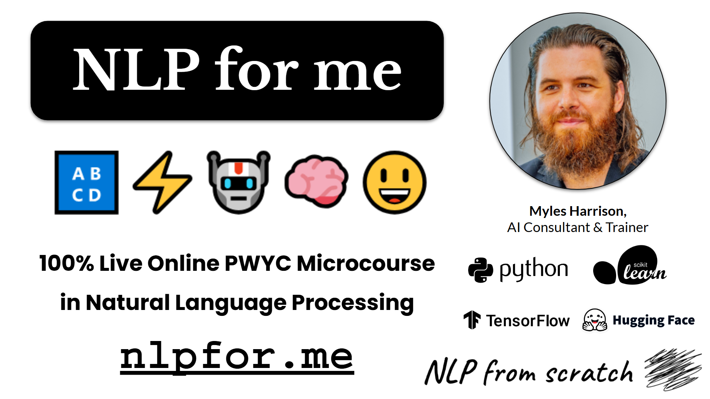

As part of NLP from scratch, two microcourses were offered:

<table style="border:none;">
<tr>
<td width="40%"></td>
<td><a href="NLPfor.me.html">NLPfor.me</a> covered fundamentals of natural language processing in python, contrasted with LLMs, and was offered from October-November of 2024.</td></tr>
<tr>
<td width="40%"></td>
<td><a href="LLMsfor.me.html">LLMsfor.me</a> was offered from January to February of 2025, and covered large language models and generative AI, including local LLM development and multimodal models.</td>
</tr>
</table>

The courses were delivered live and all course materials are now available for free here online and at their respective official github repos at [https://www.github.com/nlpfromscratch](https://www.github.com/nlpfromscratch).
