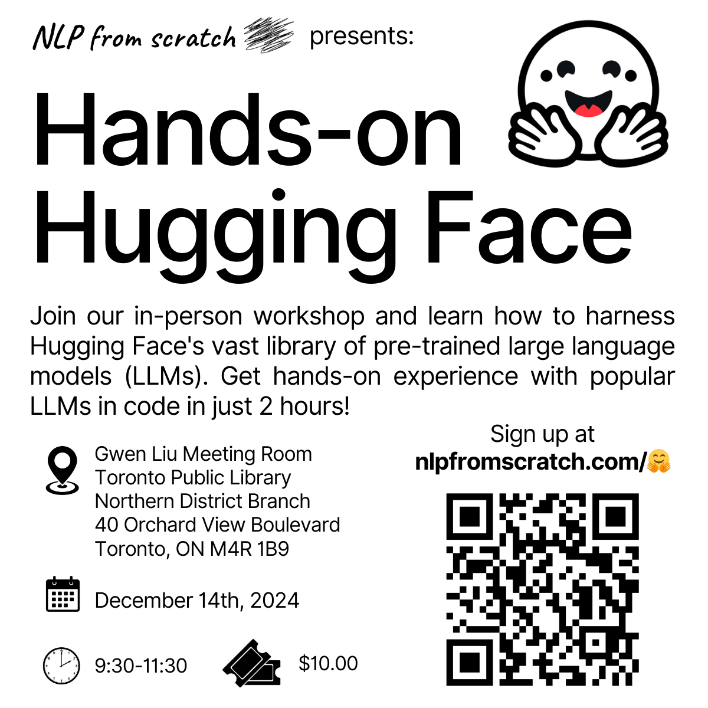

# Hands-on Hugging Face - Live Toronto Large Language Models (LLMs) Workshop

<div align="center">

</div>

## About
Date 📅: Saturday, December 14th, 2024  
Time 🕤: 9:30 - 11:30 AM  
Location 📍: Gwen Liu Meeting Room 200, Toronto Public Library Northern District Branch, 40 Orchard View Blvd, Toronto, ON M4R 1B9  


**What You'll Learn:**  
- Define large language models (LLMs) and the transformer architecture; understand the history of their development, key concepts, and high-level details of their structure and function
- Be introduced to Hugging Face and the transformers library and see applications thereof in code, using LLMs for generative text
- Use the `transformers` library to work with generative text models such as GPT and LLaMA
- Generate images using the latest cutting edge diffusion models and the Hugging Face `diffusers` library

**Who Should Attend:**
- Beginners and non-technical individuals with some familiarity with programming, interested in learning LLMs and GenAI
- Working professionals looking to build their skill set into LLMs
- Students and aspiring data science professionals

**What to Bring**
- Your laptop, power code and mouse
- Notebook for taking notes
- An active Gmail / Google account and/or a local python installation meeting the below requirements
- Some basic knowledge of python or a similar programming language

## Requirements
These notebooks can be run entirely in [Google Colab](https://colab.google/). If you wish to run these locally in your own python install (or virtualenv / conda environment),  you should install the following dependencies:
```bash
pip install transformers diffusers accelerate
```

## Files
- Slides: [Hands-on Hugging Face - 2024-12-14.pdf](./Hands-on%20Hugging%20Face%20-%202024-12-14.pdf)
- Notebook: [Hands_on_Hugging_Face_2024_12_14.ipynb](Hands_on_Hugging_Face_2024_12_14.ipynb)  <a target="_blank" href="https://colab.research.google.com/github/nlpfromscratch/nlpfromscratch.github.io/blob/main/Workshops/Hands_on_Hugging_Face_2024_12_14.ipynb">
  </a>
- Solution Notebook: [Hugging_Face_2024_12_14_Solutions.ipynb](Hugging_Face_2024_12_14_Solutions.ipynb)  <a target="_blank" href="https://colab.research.google.com/github/nlpfromscratch/nlpfromscratch.github.io/blob/main/Workshops/Hugging_Face_2024_12_14_Solutions.ipynb">
  
  </a>

## Authors
[Myles Harrison](https://www.mylesharrison.com), AI Consultant & Trainer at [NLP from scratch](https://www.nlpfromscratch.com).
